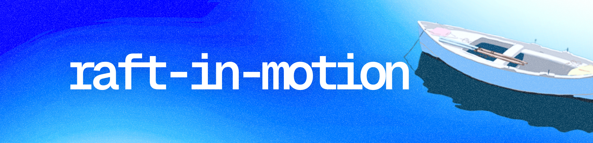

<a href="https://raft-in-motion.vercel.app">
  
</a>

## Intro...

This simulation is based on the [Raft paper](https://raft.github.io/raft.pdf).  
I built it to better understand Raft by implementing it from scratch, which eventually led to this visualizer.

You can explore the Go-only version in the `raft-test` branch (note: it's not optimized).</br>
If the simulation doesn't run or connection feels slow, blame aws—it’s expensive.

---

## Features so far 

- [x] Spawn servers and hold consensus.
- [x] Sync. through RPC.
- [x] Simple KV client & server on app layer.
- [x] Kill & respawn nodes.
- [x] Update log entries via heartbeats.
- [x] Ws conn. between client-side & ws-server.
- [x] Logs visualization.
- [x] CI/CD pipeline w/[docker + aws ec2] & vercel.
- [x] Rev. proxy using Nginx [No-IP + Let's Encrypt SSL].
- [ ] Reliable persistent storage.
- [ ] Still some test cases fails, fix them.
- [ ] Sync logs more tightly.
- [ ] Simulate more cases and visualize.
- [ ] Reduce rate-limiting and allow more active conn.
- [ ] Interactive Simulations.

---

## Project Structure

- `cmd/`        - Main entry point of the Go application  
- `frontend/`   - Next.js client-side for visualization  
- `internal/`   - Core logic:  
  - `client/`    - Client implementation  
  - `harness/`   - Test harness  
  - `kv/`        - Key-value store  
  - `logger/`    - Logging utilities  
  - `raft/`      - Raft consensus  
  - `ws/`        - WebSocket handling  

## Running the Project

```bash
# running the go ws server.
docker build -t raft-in-motion .
docker run -p 8080:8080 raft-in-motion
```

```bash
# client-side 
cd frontend/
npm install
npm run dev
```

## Resources

Here are some resources I took reference and learned from while building this project — in no particular order:

- [A Student’s Guide to Raft](https://thesquareplanet.com/blog/students-guide-to-raft/) [more of a guide to understand the paper.]

- [The Secret Lives of Data — Raft Visualization](https://thesecretlivesofdata.com/raft/)  [visualization of raft.]

- [6.824 Distributed Systems Course [YouTube]](https://www.youtube.com/@6.824) [goated distributed sys playlist to get started to and some labs on Go as well.]

- [Raft Implementation in Go - Phil Eaton](https://notes.eatonphil.com/2023-05-25-raft.html) [not purely paper based but nice read.]

- [Raft Implementation in Go - Eli Bendersky](https://eli.thegreenplace.net/2020/implementing-raft-part-0-introduction/) [well documentated; easy to follow.]

- [HashiCorp's Raft Go Package](https://pkg.go.dev/github.com/hashicorp/raft)  [official go raft pkg.]

## License

This project is licensed under the MIT-License. See the [LICENSE](LICENSE) file for details.

## Contributing

If you have any suggestions or improvements, please create an issue or a pull request. I'll try to respond to all issues and pull requests.
